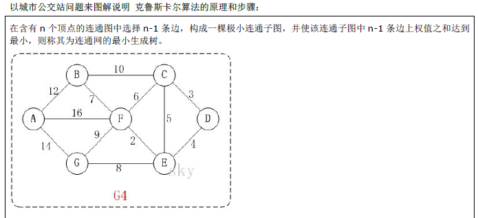
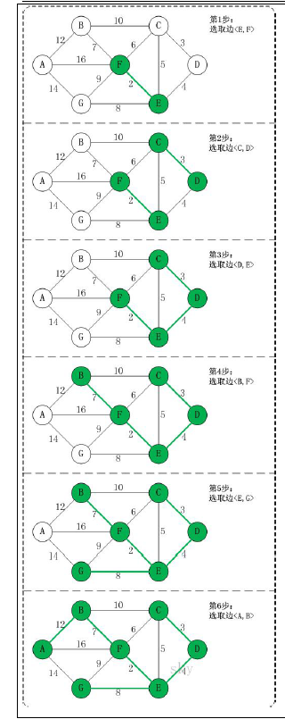

# 克鲁斯卡尔算法
> 最小生成树算法
- 算法简介
    + 克鲁斯卡尔算法是用来求加权连通图的最小生成树的算法
    + 基本思想：按照照加权从小到大的顺序选择n-1条边，并保证这n-1条边不构成回路
    + 具体做法：首先构造一个只含n个顶点的森林，然后依照权值从小到大从连通图种选择边加入森林，并使森林种不产生回路，直到森林变成一棵树为止
- 问题举例
    + 问题描述
    
    
    + kruskal解题步骤
    
    
    
- 算法关键点
    + 如何避免产生回路
    
    记录顶点在“最小生成树”种的终点，顶点的终点是“在最小生成树种与它连通的最大顶点”，然后每次需要将一条边添加到最小生成树时，判断该边的两个顶点的终点是否重合，重合的话则构成回路