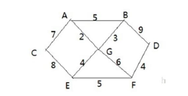
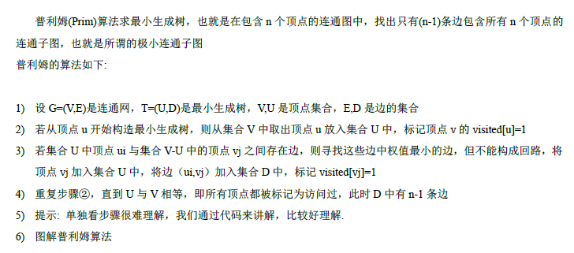

# 普里姆算法
- 应用场景——修路问题
- 问题描述：

    + 存在7个村庄（A,B,C,E,F,G)现需修路将它们全部连通
    + 各个村庄的距离用边线表示
    + 如何修路保证各个村庄都能连通，并且修建公路总里程最短
- 解题思路：
    + 尽可能选择少道德路线并且每条路线最小，保证总里程数最少
    + 该问题的实质是`最小生成树`问题;给定一个带权的无向连通图，如何选取一颗生成树，使得树上所有边上的权的综合最小，这就叫最小生成树，最小生成树存在以下特征
        * N个顶点，一定有N-1条边
        * 包含全部顶点
        * N-1条边都在图中
- 算法描述

    